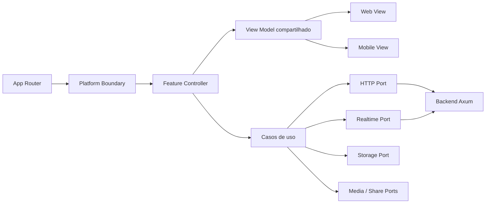

# PRD — Interface Web responsiva Mobile-First

**Produto:** Fodinha / Oh Hell Game V2  
**Data:** 04/07/2026  
**Status:** pronto para refinamento técnico e implementação  
**Escopo auditado:** frontend `ohhell-game-v2`, backend `oh_hell_rs` local e diferenças relevantes de `origin/main` do backend

---

## 1. Resumo executivo

O produto continuará sendo **um único site**, com uma única publicação e as mesmas URLs. Ele terá duas apresentações responsivas — **Mobile Web** como base e **Desktop Web** a partir do breakpoint — preservando uma única implementação para regras, sessão, autenticação, contratos HTTP, eventos WebSocket, preferências e traduções.

A solução recomendada não é duplicar páginas inteiras com sua lógica. Cada feature terá:

1. um **controller compartilhado**, responsável por estado, efeitos e ações;
2. um **view model estável**, consumido pelas duas interfaces;
3. uma **view Web**;
4. uma **view Mobile**;
5. adaptadores isolados para APIs do navegador, como storage, áudio, clipboard/share e Google Identity.

O ponto mais crítico é a partida. O arquivo atual `src/app/routes/Game/Game.jsx` possui 2.613 linhas e reúne normalização de domínio, sessão, WebSocket, áudio, timers, persistência e toda a renderização responsiva. A migração deverá primeiro extrair essa lógica para um controller único; só depois as mesas Web e Mobile poderão divergir com segurança.

### Decisão de produto adotada

- **Entrega:** um único aplicativo React/Vite responsivo, nas mesmas URLs, domínio, deploy e backend.
- **Mobile-first:** os estilos e componentes base atendem de 320 a 767 CSS px; Desktop é aplicado progressivamente a partir de 768 CSS px.
- **Não haverá redirecionamento por user-agent.** A escolha será feita no cliente por viewport/capacidade, com override de QA.
- **Uma troca de layout não pode remontar o controller da feature.** Na partida, deve existir exatamente uma conexão WebSocket por rota ativa.
- **Não será criado um aplicativo instalável/publicável.** React Native, Capacitor, PWA e publicação em App Store/Google Play estão fora de escopo.

---

## 2. Evidências da auditoria

### 2.1 Frontend

- React 19.2, React Router 7.18, Vite 8, Tailwind 4, Radix/shadcn e i18next.
- 229 arquivos relevantes sem `node_modules`; 172 são assets.
- Assets somam aproximadamente **88,22 MiB**:
  - cartas: 63,26 MiB;
  - avatares: 17,97 MiB;
  - vídeo da Home: 6,43 MiB.
- As cartas e avatares são indexados com `import.meta.glob(..., { eager: true })`.
- Todas as rotas são importadas estaticamente pelo router; não há code splitting por rota.
- Não há suíte de testes, script de lint ou typecheck no frontend. Os scripts atuais são apenas `dev`, `build` e `preview`.
- A validação de build transformou 2.084 módulos, mas falhou ao resolver `primeicons/primeicons.css` em `src/index.css`. Deve-se executar `npm ci` e repetir o build antes da migração para distinguir instalação incompleta de defeito de dependência.
- O layout atual usa uma única Sidebar responsiva. O estado expandido/recolhido é salvo em `localStorage`.
- `Leaderboard.jsx` já renderiza cards Mobile e tabela Web no mesmo componente; é um bom caso-piloto para separar controller e views.
- `HowToPlay` é uma página placeholder.
- Existe `Settings/Settings.jsx`, mas ela não está registrada no router; as configurações funcionais vivem em modal aberto pela Sidebar.
- A rota `/github` existe, porém a navegação principal abre o repositório externamente.
- O frontend acessa diretamente `window`, `document`, `localStorage`, `navigator.clipboard`, `Audio`, `WebSocket`, `fetch`, `atob` e Google Identity em diferentes camadas.
- Há inversão indevida de dependência: `authService.js` importa metadados de avatar da camada `components`.

### 2.2 Rotas e fluxos atuais

| Rota | Estado atual | Dependências principais |
|---|---|---|
| `/` | Home, perfil guest/Google e atalhos | auth, assets, i18n |
| `/create-game` | Criação com 1–5 vidas; sala pública desativada | `POST /lobby` |
| `/game` | Redireciona para `/create-game` | router |
| `/game/:lobbyId` | Autenticação, lobby, partida e resultado | HTTP, WebSocket, storage, áudio |
| `/rooms` | Lista, refresh, entrar e criar sala | `GET /lobby` |
| `/leaderboard` | Ranking global | `GET /stats?limit=100` |
| `/how-to-play` | Placeholder | i18n |
| `/github` | Página intermediária para link externo | navegação externa |
| `*` | Redireciona para `/` | router |

### 2.3 Contratos backend

**HTTP:**

- `POST /auth/signup`
- `POST /auth/profile` — autenticado
- `POST /auth/google` — presente em `origin/main`, ausente no checkout local
- `POST /auth/refresh` — presente em `origin/main`, ausente no checkout local
- `GET /lobby` — autenticado
- `POST /lobby` — autenticado; aceita `lifes`
- `PUT /lobby/:id` — autenticado
- `GET /stats?limit=` — público
- `GET /stats/me` — autenticado
- `GET /metrics` — presente em `origin/main`

**WebSocket:** `GET /game?token=<JWT>`

Comandos do cliente:

- `PlayTurn { card }`
- `PutBid { bid }`
- `PlayerStatusChange { ready }`

Mensagens do servidor:

- `Snapshot`
- `PlayerJoined`
- `PlayerLeft`
- `PlayerStatusChange`
- `PlayerBidded`
- `PlayerBiddingTurn`
- `PlayerDeck`
- `PlayerTurn`
- `TurnPlayed`
- `RoundEnded`
- `SetStart`
- `SetEnded`
- `GameEnded`
- `Error`

### 2.4 Backend e operação

- Rust/Axum, MongoDB, actors por partida, event sourcing de partidas e projeção assíncrona de estatísticas.
- O backend local está **25 commits atrás de `origin/main`**.
- `origin/main` adiciona, entre outros: Google auth, refresh token, métricas/OpenTelemetry, graceful shutdown, timeout de lobby, cliente/load tester e correções de snapshot.
- O frontend atual já chama `/auth/google` e persiste refresh token, portanto o contrato esperado é o de `origin/main`, não o checkout local.
- O frontend ainda não chama `/auth/refresh`; quando o token é inválido, pode recriar o guest e trocar sua identidade.
- O backend possui testes unitários e de integração, mas não foi possível executá-los neste ambiente porque `cargo` não está instalado.
- Os workflows de frontend e backend fazem deploy no Fly.io em push para `main`, mas não executam build, lint ou testes antes do deploy.

---

## 3. Problema a resolver

O design responsivo atual mistura decisões Mobile e Web dentro dos mesmos componentes. Isso cria cinco riscos:

1. **Regressão cruzada:** uma alteração Mobile pode quebrar a mesa Web e vice-versa.
2. **Duplicação futura:** copiar `Game.jsx` duplicaria regras de sessão, timers e interpretação de eventos.
3. **Acoplamento ao browser:** serviços não podem ser reaproveitados por outra plataforma sem substituir globals.
4. **Baixa testabilidade:** dados, efeitos e marcação estão no mesmo arquivo e não há testes de frontend.
5. **Custo Mobile:** mídia e assets são pesados, rotas não são lazy e o vídeo da Home é carregado automaticamente.

---

## 4. Objetivos e métricas

### Objetivos

- Permitir que os layouts Mobile e Desktop do mesmo site evoluam visualmente de forma independente.
- Manter paridade funcional e um único conjunto de regras e contratos.
- Reduzir o risco da partida em tempo real.
- Melhorar ergonomia Mobile, acessibilidade e performance.
- Criar uma base verificável com testes e rollout controlado.

### Indicadores de sucesso

| Indicador | Meta |
|---|---|
| Conexões WebSocket por partida ativa | exatamente 1 por aba |
| Duplicação de lógica de feature entre Web/Mobile | 0 casos de fetch, socket ou storage nas views |
| Cobertura dos reducers/parsers da partida | ≥ 90% de branches |
| Cobertura dos controllers críticos | ≥ 80% de branches |
| Fluxos E2E críticos | 100% em Web e Mobile |
| Alvos de toque Mobile | mínimo 44×44 CSS px |
| LCP Mobile da Home | ≤ 2,5 s no p75 |
| Erros não tratados ao trocar de layout | 0 |
| Paridade de contratos HTTP/WebSocket | contrato automatizado no CI |

---

## 5. Fora de escopo

- Reescrever as regras do jogo no frontend.
- Criar um backend separado para Mobile.
- Alterar o formato das cartas ou as regras de bidding sem uma demanda própria.
- Criar React Native, Capacitor, PWA, binários iOS/Android ou publicação em lojas.
- Redesenhar a marca completa.
- Implementar sala pública antes de existir suporte de produto/backend definido.

---

## 6. Arquitetura-alvo



### 6.1 Regra de composição

Cada rota monta o controller uma vez e alterna apenas a view:

```text
GameRoute
 ├─ useGameSessionController(lobbyId)   ← único socket e única máquina de estado
 └─ PlatformView
     ├─ GameWebView(viewModel, actions)
     └─ GameMobileView(viewModel, actions)
```

### 6.2 Estrutura proposta

```text
src/
  app/
    router/
    platform/
      PlatformProvider.jsx
      PlatformView.jsx
    layouts/
      WebAppLayout.jsx
      MobileAppLayout.jsx
  core/
    cards/
    players/
    game-session/
    contracts/
  application/
    auth/
    lobby/
    game/
    stats/
    preferences/
  infrastructure/
    http/
    realtime/
    storage/
    auth/
    audio/
    sharing/
  features/
    home/{HomeRoute,web,mobile,shared}/
    create-game/{CreateGameRoute,web,mobile,shared}/
    rooms/{RoomsRoute,web,mobile,shared}/
    game/{GameRoute,web,mobile,shared}/
    leaderboard/{LeaderboardRoute,web,mobile,shared}/
    how-to-play/{HowToPlayRoute,web,mobile,shared}/
    settings/{web,mobile,shared}/
  shared/
    assets/
    avatars/
    i18n/
    ui-web/
    ui-mobile/
```

### 6.3 Fronteiras obrigatórias

- Views não podem chamar `fetch`, `WebSocket`, `localStorage`, `Audio` ou Google Identity.
- Views recebem somente dados serializáveis e callbacks do controller.
- O controller da partida não pode importar componentes Web ou Mobile.
- Parsers e reducers de mensagens WebSocket devem ser funções puras.
- Metadados de avatar e carta devem sair da pasta `components`.
- Storage deve ser acessado pela interface `storage.get/set/remove/subscribe`.
- Compartilhamento deve usar uma porta com fallback: Web Share API → clipboard.
- Áudio deve respeitar preferência, visibilidade da página e política de autoplay.
- O router não deve duplicar URLs por plataforma.
- O breakpoint deve ter uma única fonte de verdade; não misturar 640 e 768 como fronteira de produto.

---

## 7. Módulos e User Stories

## MOD 00 — Fundação de plataforma e contratos

**Objetivo:** criar a base que impede duplicação de regras entre Web e Mobile.

### US 001 — Classificador de plataforma

Como produto, quero selecionar a apresentação Mobile ou Desktop pela largura disponível sem alterar a URL, para manter links e navegação compatíveis.

**Critérios de aceite:**

- Mobile é o padrão abaixo de 768 px; Desktop é aplicado a partir de 768 px.
- O CSS é escrito mobile-first: regras base para Mobile e media queries `min-width` para Desktop.
- Existe override não persistente de QA (`?ui=mobile|web`).
- A troca de largura preserva rota, dados carregados, formulário e sessão.
- O classificador é testável sem `window` real.

### US 002 — Controller compartilhado por feature

Como engenharia, quero que cada feature possua um controller único, para que as views não dupliquem efeitos.

**Critérios de aceite:**

- Cada route component monta um controller e uma view.
- Views não importam services ou infrastructure.
- Web e Mobile recebem o mesmo contrato de view model e ações.

### US 003 — Adaptador de storage

Como aplicação, quero persistir token, perfil, idioma, tema e preferências por uma interface única.

**Critérios de aceite:**

- Nenhum caso de uso acessa `localStorage` diretamente.
- Chaves atuais são migradas sem perda de dados.
- Falhas de storage não impedem uso da aplicação.
- Tokens e preferências possuem testes de migração.

### US 004 — Cliente HTTP compartilhado

Como aplicação, quero um cliente HTTP independente da UI, para usar os mesmos casos de uso nas duas apresentações.

**Critérios de aceite:**

- Suporta base URL, query, JSON, cancelamento, autenticação e erro tipado.
- Access token é anexado por interceptor/adaptador.
- Respostas de erro preservam status e payload.

### US 005 — Cliente realtime compartilhado

Como aplicação, quero uma sessão WebSocket centralizada, para garantir uma conexão consistente por partida.

**Critérios de aceite:**

- Há exatamente um socket por `GameRoute` montado.
- Comandos durante `CONNECTING` são enfileirados.
- Desmontagem fecha socket e timers.
- Reconexão consome `Snapshot` e recompõe o estado.
- Trocar Web/Mobile não reconecta.

### US 006 — Contratos HTTP e WebSocket verificáveis

Como engenharia, quero contratos versionados entre JS e Rust, para detectar incompatibilidades antes do deploy.

**Critérios de aceite:**

- Há fixtures para todos os endpoints e tipos de mensagem.
- CI valida serialização de comandos e mensagens.
- Diferenças entre checkout local e `origin/main` são resolvidas antes do desenvolvimento.

### US 007 — Catálogo de assets compartilhado

Como aplicação, quero metadados de cartas e avatares fora da camada visual, para que controllers não dependam de componentes.

**Critérios de aceite:**

- `authService` e domínio não importam `components`.
- Rank/suit, labels e resolução de avatar têm uma única implementação.
- Assets Mobile podem ser otimizados sem mudar os contratos de domínio.

## MOD 01 — Shell e navegação

**Objetivo:** fornecer navegação própria por plataforma com as mesmas rotas e capacidades.

### US 008 — Sidebar Web

Como usuário Web, quero uma Sidebar fixa e recolhível, para acessar rapidamente as seções do jogo.

**Critérios de aceite:**

- Exibe Home, Criar jogo, Salas, Ranking, Como jogar, GitHub, Configurações e Idioma.
- Mantém estado recolhido entre sessões.
- Possui labels/tooltip no modo recolhido e navegação por teclado.
- O conteúdo recebe offset correto sem salto de layout.

### US 009 — Navegação Mobile

Como usuário Mobile, quero uma navegação adequada ao toque, para não depender de uma Sidebar desktop reduzida.

**Critérios de aceite:**

- Usa header compacto e bottom navigation para destinos primários.
- Destinos secundários ficam em sheet/drawer.
- Respeita `safe-area-inset-top` e `safe-area-inset-bottom`.
- Alvos de toque têm ao menos 44×44 px.

### US 010 — Estado ativo e deep links

Como usuário, quero que a navegação indique a seção atual e preserve deep links.

**Critérios de aceite:**

- O destino ativo é equivalente em Web e Mobile.
- Abrir `/game/:lobbyId` diretamente funciona nas duas views.
- A rota desconhecida volta à Home sem loop.

### US 011 — Configurações a partir do shell

Como usuário, quero abrir configurações e idioma de qualquer tela comum.

**Critérios de aceite:**

- Web abre modal/painel; Mobile abre tela ou bottom sheet própria.
- Fechar retorna ao foco/origem anterior.
- A mesa define um acesso que não bloqueia cartas ou controles.

### US 012 — Tema no shell

Como usuário, quero alternar tema claro/escuro e manter a escolha.

**Critérios de aceite:**

- A escolha é refletida imediatamente nas duas apresentações.
- Não há flash de tema incorreto no carregamento.
- Contraste atende WCAG AA.

## MOD 02 — Home Page

**Objetivo:** apresentar o produto, perfil e entradas principais com composições distintas.

### US 013 — Hero Web

Como visitante Web, quero uma apresentação imersiva do jogo sem perder acesso às ações principais.

**Critérios de aceite:**

- Hero, perfil e atalhos cabem no viewport comum de desktop sem ocultar ações.
- Vídeo possui poster e respeita `prefers-reduced-motion`.
- Ausência/falha do vídeo não impede a Home.

### US 014 — Hero Mobile otimizado

Como visitante Mobile, quero uma Home rápida e legível, para iniciar sem baixar mídia desnecessária.

**Critérios de aceite:**

- O vídeo pesado não carrega automaticamente em conexão econômica ou reduced motion.
- CTA de jogar/criar fica visível no primeiro viewport.
- O título não depende de hacks de duas traduções separadas.

### US 015 — Atalhos da Home

Como usuário, quero acessar Criar jogo, Salas, Ranking, Como jogar e GitHub.

**Critérios de aceite:**

- Web usa grade; Mobile usa cards/lista de uma coluna.
- Links internos usam router; externos indicam nova janela.
- Todos têm nome acessível e feedback de interação.

### US 016 — Resumo de perfil na Home

Como jogador, quero visualizar e editar nick/avatar na Home.

**Critérios de aceite:**

- Estado salvo é o mesmo em Web e Mobile.
- A UI Mobile não exige modal maior que o viewport.
- Erros de autenticação permanecem próximos da ação.

### US 017 — Estados de carregamento e indisponibilidade

Como usuário, quero feedback quando recursos da Home demorarem ou falharem.

**Critérios de aceite:**

- Assets possuem fallback visual.
- Google indisponível não bloqueia guest.
- A Home continua navegável sem backend.

## MOD 03 — Autenticação e perfil

**Objetivo:** preservar identidade guest/Google em ambas as apresentações e alinhar o contrato atual do backend.

### US 018 — Cadastro e atualização Guest

Como visitante, quero jogar como guest com nick e avatar.

**Critérios de aceite:**

- Nick aceita até 24 caracteres em frontend e backend.
- Salvar cria ou atualiza o guest conforme o token atual.
- Feedback de sucesso/erro é equivalente em Web e Mobile.

### US 019 — Seleção de avatar Web

Como usuário Web, quero escolher avatar em um diálogo navegável por teclado.

**Critérios de aceite:**

- Escape fecha, foco fica preso e retorna ao gatilho.
- PNG e GIF são agrupados e possuem seleção visível.
- A lista não carrega mídia fora de viewport sem necessidade.

### US 020 — Seleção de avatar Mobile

Como usuário Mobile, quero escolher avatar em uma grade própria para toque.

**Critérios de aceite:**

- Usa tela/bottom sheet com scroll e safe areas.
- Selecionar não provoca scroll lock residual.
- GIFs podem respeitar reduced motion/economia de dados.

### US 021 — Login Google

Como usuário, quero migrar meu guest para Google preservando nick e avatar.

**Critérios de aceite:**

- Usa `POST /auth/google` do backend atualizado.
- O guest atual é anexado quando aplicável.
- Ausência de client ID oculta a opção sem quebrar a tela.
- Erro do SDK/endpoint é recuperável.

### US 022 — Renovação de sessão

Como jogador autenticado, quero renovar o access token sem perder minha identidade.

**Critérios de aceite:**

- Usa `POST /auth/refresh` antes de recriar o guest.
- Refresh token é rotacionado e armazenado pelo adaptador.
- Uma única renovação é executada para requisições concorrentes.
- Falha definitiva limpa a sessão e pede confirmação do perfil.

### US 023 — Gate de entrada na sala

Como jogador, quero confirmar meu perfil antes de entrar na sala.

**Critérios de aceite:**

- Gate usa o mesmo controller nas views Web/Mobile.
- Confirmar aguarda persistência antes de `PUT /lobby/:id`.
- Repetir a ação não cria dois jogadores nem dois sockets.

### US 024 — Segurança de token

Como produto, quero reduzir exposição indevida de credenciais.

**Critérios de aceite:**

- Tokens não são registrados em logs.
- A URL do WebSocket com token não é exibida pela UI/telemetria.
- A estratégia de armazenamento no navegador é documentada e não presume APIs nativas.

## MOD 04 — Criar jogo

**Objetivo:** configurar e criar uma sala com experiência adequada a cada plataforma.

### US 025 — Configuração de vidas

Como criador, quero escolher de 1 a 5 vidas antes de abrir a sala.

**Critérios de aceite:**

- Valor padrão é 5 e somente valores válidos são enviados.
- O valor é preservado na navegação e recuperável por lobby.
- Web pode usar combobox; Mobile usa stepper ou bottom sheet otimizado para toque.

### US 026 — Criação de sala

Como criador, quero criar uma sala e entrar nela automaticamente.

**Critérios de aceite:**

- Executa uma única chamada `POST /lobby`.
- Sucesso navega para `/game/:lobbyId`.
- Loading bloqueia duplo submit; erro permite tentar novamente.

### US 027 — Voltar à Home

Como usuário, quero desistir da criação e voltar sem resíduos.

**Critérios de aceite:**

- Voltar não cria lobby.
- O comportamento de browser/back e botão da UI é consistente.

### US 028 — Sala pública futura

Como produto, quero que a opção de sala pública não pareça funcional antes do backend.

**Critérios de aceite:**

- O controle permanece oculto ou claramente marcado como indisponível.
- Ativação futura exige contrato e história próprios; não enviar campo ignorado.

## MOD 05 — Salas

**Objetivo:** listar e ingressar em lobbies públicos/abertos com views diferentes.

### US 029 — Listagem Web

Como jogador Web, quero comparar salas em uma lista tabular densa.

**Critérios de aceite:**

- Exibe id, jogadores/capacidade, estado e ação Entrar.
- Cabe em 768 px sem scroll horizontal desnecessário.

### US 030 — Listagem Mobile

Como jogador Mobile, quero navegar por salas em cards de toque.

**Critérios de aceite:**

- Cada card expõe identificação, contagem e CTA.
- Identificadores longos truncam visualmente, mas podem ser copiados/lidos.

### US 031 — Atualizar salas

Como jogador, quero atualizar a lista e entender seu estado.

**Critérios de aceite:**

- Loading inicial, refresh, vazio e erro são distintos.
- Refresh não apaga a lista válida antes da resposta.
- Requisição anterior pode ser cancelada ao sair.

### US 032 — Entrar em uma sala

Como jogador, quero selecionar uma sala e seguir para seu gate/lobby.

**Critérios de aceite:**

- Navega para a rota canônica.
- Erros 404, 409 e 403 recebem mensagens acionáveis.

### US 033 — Criar a partir de Salas

Como jogador, quero iniciar a criação quando não encontrar uma sala.

**Critérios de aceite:**

- CTA está presente no header e estado vazio.
- Usa a mesma rota `/create-game`.

## MOD 06 — Lobby e pré-partida

**Objetivo:** gerenciar entrada, presença, convite e ready antes do jogo.

### US 034 — Snapshot inicial

Como participante, quero ver o estado real da sala ao entrar ou reconectar.

**Critérios de aceite:**

- `PUT /lobby/:id` é processado antes da conexão realtime.
- `Snapshot.Waiting` substitui estado especulativo sem duplicar jogadores.
- Nick, avatar e ready são hidratados.

### US 035 — Presença de jogadores

Como participante, quero ver entradas e saídas em tempo real.

**Critérios de aceite:**

- `PlayerJoined` e `PlayerLeft` atualizam as duas views pelo mesmo reducer.
- Máximo visual e de produto é alinhado ao backend antes da release; hoje UI assume 10 e backend suporta até 13.

### US 036 — Ready

Como participante, quero marcar/desmarcar ready e acompanhar o grupo.

**Critérios de aceite:**

- Comando é `PlayerStatusChange`.
- Ação exige ao menos dois jogadores e socket aberto.
- Estado pending evita envios repetidos.

### US 037 — Convite Web

Como criador Web, quero copiar o link da sala.

**Critérios de aceite:**

- Clipboard possui fallback e feedback temporário.
- Link usa origem atual e rota canônica.

### US 038 — Convite Mobile

Como criador Mobile Web, quero abrir o compartilhamento do navegador quando disponível.

**Critérios de aceite:**

- Usa Web Share API; fallback copia o link.
- Cancelar share não é tratado como erro.

### US 039 — Falha e reconexão no lobby

Como participante, quero recuperar a conexão sem perder a sala.

**Critérios de aceite:**

- UI diferencia offline, reconectando e erro definitivo.
- Reconexão usa backoff limitado e solicita snapshot.
- Não abre sockets paralelos.

## MOD 07 — Mesa e gameplay

**Objetivo:** criar mesas visualmente independentes sobre a mesma máquina de sessão.

### US 040 — Máquina de estado compartilhada

Como engenharia, quero reduzir todas as mensagens do jogo em estado puro, para alimentar Web e Mobile de forma idêntica.

**Critérios de aceite:**

- Estados contemplam `waiting`, `bidding`, `dealing` e `ended`.
- Todos os 14 tipos de mensagem do servidor têm fixture e teste.
- Mensagem desconhecida é ignorada/telemetrizada sem quebrar a sessão.

### US 041 — Disposição da mesa Web

Como jogador Web, quero ver jogadores, centro, mão e status aproveitando telas largas.

**Critérios de aceite:**

- Suporta o limite de jogadores aprovado sem sobreposição ilegível.
- Jogador local, turno, bid, pontos, vidas e ready são distinguíveis.
- Redimensionamento não perde o estado da partida.

### US 042 — Disposição da mesa Mobile

Como jogador Mobile, quero uma mesa legível e operável com uma mão.

**Critérios de aceite:**

- Prioriza jogador local, mão, turno atual, mesa e ação.
- Oponentes podem usar carrossel/anel compacto/detalhe sob demanda.
- Não exige rotacionar a mesa Web com CSS.
- Retrato é o modo principal; paisagem é suportada sem recarregar.

### US 043 — Baralho, joker e pilha

Como jogador, quero identificar baralho, carta joker e cartas jogadas.

**Critérios de aceite:**

- Usa o deck selecionado e labels acessíveis.
- A pilha mantém ordem e jogador de origem.
- Destaque de carta fraca não altera regra nem bloqueia interação.

### US 044 — Mão do jogador Web

Como jogador Web, quero selecionar uma carta com mouse ou teclado.

**Critérios de aceite:**

- Cartas habilitadas possuem hover, foco e nome acessível.
- Clique duplo/rápido não envia duas jogadas.

### US 045 — Mão do jogador Mobile

Como jogador Mobile, quero navegar e jogar cartas com gestos claros.

**Critérios de aceite:**

- Cartas são roláveis/selecionáveis sem conflito com scroll da página.
- A ação de jogar exige um gesto inequívoco; não dispara ao rolar.
- Área de toque e carta selecionada são visíveis.

### US 046 — Bidding

Como jogador, quero ver bids permitidos e enviar um durante minha vez.

**Critérios de aceite:**

- Somente valores recebidos em `possible_bids` são habilitados.
- Envio limpa os controles e aguarda evento do servidor.
- Web e Mobile podem ter controles distintos, mas mesma ação.

### US 047 — Timer de ação

Como jogador, quero saber quanto tempo resta para bid/jogada.

**Critérios de aceite:**

- Timer deriva do estado compartilhado.
- Expiração automática segue a regra atual e é testada com clock falso.
- Background/foreground não causa múltiplas expirações.

### US 048 — Áudio da partida

Como jogador, quero ouvir alertas de bid, turno e carta conforme meu volume.

**Critérios de aceite:**

- Sons passam por adaptador único.
- Volume 0 desativa reprodução.
- Um evento não toca duas vezes ao trocar de view/reconectar.

### US 049 — Erros de comando

Como jogador, quero entender por que uma ação falhou e tentar novamente quando seguro.

**Critérios de aceite:**

- Diferencia conexão indisponível, fase incorreta, fora de turno e erro do servidor.
- Erro não remove carta definitivamente sem confirmação/snapshot.
- Toast/banner não cobre controles essenciais no Mobile.

## MOD 08 — Rodada, vidas e fim de jogo

**Objetivo:** comunicar transições importantes sem duplicar animação e regra.

### US 050 — Fim de rodada

Como jogador, quero visualizar a última pilha antes da transição.

**Critérios de aceite:**

- `SetEnded`/`GameEnded` aguardam a animação configurada uma única vez.
- Mensagens recebidas durante o atraso são enfileiradas e aplicadas em ordem.

### US 051 — Perda de vidas

Como jogador, quero entender quem perdeu vidas e quantas.

**Critérios de aceite:**

- Cálculo vem do reducer compartilhado.
- Web usa canto não intrusivo; Mobile usa banner/toast seguro.
- Texto não contém nome hardcoded e é totalmente traduzível.

### US 052 — Resultado com vencedor

Como jogador, quero ver vencedor(es) e voltar ao menu.

**Critérios de aceite:**

- Empates/vários vencedores são suportados.
- Avatar possui fallback.
- Voltar fecha recursos da partida e navega para criação/menu definido.

### US 053 — Resultado sem vencedor

Como jogador, quero receber estado explícito quando todos ficam sem vidas.

**Critérios de aceite:**

- Mensagem e visual são distintos do vencedor.
- Reduced motion remove loops decorativos sem esconder o resultado.

## MOD 09 — Ranking e estatísticas

**Objetivo:** apresentar a mesma informação em densidades apropriadas.

### US 054 — Carregamento do ranking

Como jogador, quero consultar até 100 posições e atualizar a lista.

**Critérios de aceite:**

- Loading, dados, vazio e erro são modelados no controller.
- Refresh preserva dados anteriores até a resposta.

### US 055 — Tabela Web

Como usuário Web, quero comparar todas as métricas em tabela.

**Critérios de aceite:**

- Exibe posição, jogador, jogos, vitórias, win rate, rounds, bid, média, trunfos e favorita.
- Cabe/rola de forma acessível em telas menores de Web.

### US 056 — Cards Mobile

Como usuário Mobile, quero ver primeiro posição, jogador e desempenho principal.

**Critérios de aceite:**

- Métricas secundárias podem expandir por jogador.
- Não existe tabela horizontal obrigatória.

### US 057 — Avatar e carta favorita

Como jogador, quero reconhecer perfis e a carta favorita de cada pessoa.

**Critérios de aceite:**

- Resolução de avatar usa catálogo compartilhado.
- Rank e naipe usam labels localizadas, não strings fixas em português.

### US 058 — Minhas estatísticas

Como jogador autenticado, quero acessar minhas estatísticas quando o produto ativar essa seção.

**Critérios de aceite:**

- Caso de uso para `GET /stats/me` existe e trata `null`.
- A ativação visual será feita sob feature flag sem duplicar o ranking global.

## MOD 10 — Configurações e personalização

**Objetivo:** separar o painel Web da experiência Mobile e manter preferências únicas.

### US 059 — Volume geral

Como jogador, quero ajustar o volume de 0 a 100.

**Critérios de aceite:**

- Atualização é imediata e persistida.
- Controle possui valor acessível e funciona por teclado/toque.

### US 060 — Tipo de baralho

Como jogador, quero escolher Espanhol, Espanhol 8-bit ou Francês.

**Critérios de aceite:**

- Preview usa assets otimizados.
- Trocar durante a partida altera apenas a aparência local.

### US 061 — Verso da carta

Como jogador, quero escolher entre os versos disponíveis.

**Critérios de aceite:**

- Valor inválido retorna ao padrão.
- Preview e mesa usam a mesma preferência.

### US 062 — Painel Web de configurações

Como usuário Web, quero configurar jogo e idioma em modal/painel organizado.

**Critérios de aceite:**

- Abas têm foco, labels e fechamento acessíveis.
- Altura não depende de valores frágeis do viewport.

### US 063 — Tela Mobile de configurações

Como usuário Mobile, quero uma tela de configurações rolável e adequada a safe areas.

**Critérios de aceite:**

- Não comprime as opções em modal de 54dvh.
- Voltar preserva preferências e rota anterior.

### US 064 — Sincronização de preferências

Como usuário com mais de uma aba, quero que mudanças locais sejam refletidas.

**Critérios de aceite:**

- Adaptador suporta evento local e `storage` entre abas.
- Uma mudança não gera loop de eventos.

## MOD 11 — Idioma e conteúdo

**Objetivo:** manter PT/EN completos e independentes de layout.

### US 065 — Troca de idioma

Como usuário, quero alternar Português/Inglês e manter a escolha.

**Critérios de aceite:**

- Toda view reage sem reload.
- Idioma inválido usa fallback definido.

### US 066 — Paridade de traduções

Como produto, quero as mesmas chaves em PT e EN.

**Critérios de aceite:**

- CI falha por chave ausente ou extra.
- Não há strings de produto hardcoded em componentes, incluindo cartas, erros e “João plays”.

### US 067 — Conteúdo responsivo sem chave visual

Como tradução, quero um único significado por chave, para não acoplar texto a quebras Mobile.

**Critérios de aceite:**

- Remove a dependência de `appNameShort`/`appNameShort2` para montar layout.
- Quebras de linha são responsabilidade da view/CSS.

### US 068 — Formatação localizada

Como usuário, quero percentuais, números e nomes de cartas no idioma atual.

**Critérios de aceite:**

- Usa `Intl.NumberFormat`/recursos equivalentes.
- Naipes e ranks são traduzidos pelo catálogo.

## MOD 12 — Como jogar

**Objetivo:** substituir o placeholder por conteúdo útil nas duas apresentações.

### US 069 — Regras essenciais

Como iniciante, quero entender objetivo, sequência de cartas, trunfo, bid, pontos e vidas.

**Critérios de aceite:**

- Conteúdo cobre o comportamento implementado pelo backend.
- PT e EN passam por revisão.

### US 070 — Navegação do guia Web

Como usuário Web, quero índice lateral/âncoras para navegar no guia.

**Critérios de aceite:**

- Seção ativa é indicada e links são compartilháveis.

### US 071 — Navegação do guia Mobile

Como usuário Mobile, quero seções recolhíveis e exemplos legíveis.

**Critérios de aceite:**

- Não há scroll horizontal.
- Estado de seção não interfere com browser back.

## MOD 13 — GitHub e informações externas

**Objetivo:** manter a saída externa explícita e simples.

### US 072 — Abrir repositório

Como usuário, quero abrir o repositório do projeto com clareza.

**Critérios de aceite:**

- Link externo é único e configurável.
- Web abre nova aba; Mobile permite abertura pelo sistema.
- A rota intermediária deve ser removida ou adotada consistentemente, não permanecer duplicada.

## MOD 14 — Qualidade, performance e rollout

**Objetivo:** provar paridade e lançar sem interromper partidas.

### US 073 — Testes unitários de domínio/frontend

Como engenharia, quero testar reducers, parsers, catálogo e regras de apresentação.

**Critérios de aceite:**

- Vitest cobre contratos, storage, auth refresh, cards e reducer da partida.
- Timers usam clock falso.
- Views são testadas com view models, sem backend real.

### US 074 — Testes de integração dos controllers

Como engenharia, quero validar efeitos sem depender de layout.

**Critérios de aceite:**

- HTTP, socket, áudio e storage usam fakes.
- Verifica uma conexão, cleanup, retry e snapshot.

### US 075 — E2E Web e Mobile

Como produto, quero validar os fluxos principais nos dois layouts.

**Critérios de aceite:**

- Playwright cobre: guest, criar, compartilhar/entrar, ready, bid, jogar, resultado, ranking, idioma e preferências.
- Viewports mínimos: 360×800, 390×844, 768×1024 e 1440×900.
- Ao menos um teste redimensiona durante a partida e confirma socket único.

### US 076 — Lazy loading por rota e plataforma

Como usuário Mobile, quero baixar apenas o necessário para a tela atual.

**Critérios de aceite:**

- Rotas usam `React.lazy`/chunks equivalentes.
- View Web não entra no chunk inicial Mobile e vice-versa quando possível.
- Assets de decks são carregados sob demanda.

### US 077 — Otimização de mídia

Como usuário em rede móvel, quero evitar transferências excessivas.

**Critérios de aceite:**

- Cartas, GIFs, versos e vídeo têm formatos/tamanhos revisados.
- Home Mobile usa poster/imagem leve por padrão.
- Há budgets automatizados de bundle e assets no CI.

### US 078 — Acessibilidade e motion

Como usuário com necessidades de acesso, quero operar o jogo por tecnologias assistivas e reduzir movimento.

**Critérios de aceite:**

- Foco, nomes acessíveis, contraste, teclado e toque são auditados.
- `prefers-reduced-motion` desativa animações não essenciais.
- Eventos críticos não são comunicados apenas por cor/som.

### US 079 — CI de qualidade

Como equipe, quero impedir deploy de código que não compila ou não passa testes.

**Critérios de aceite:**

- Frontend: install congelado, lint, testes e build.
- Backend: format, clippy, testes e build.
- Deploy depende dos gates anteriores.

### US 080 — Feature flag e rollout

Como produto, quero liberar a nova UI Mobile progressivamente.

**Critérios de aceite:**

- Flag separa Mobile atual e Mobile v2 durante migração.
- QA pode forçar plataforma/flag por query sem persistir em produção.
- Rollback não altera contratos nem dados.

### US 081 — Observabilidade de frontend

Como operação, quero detectar falhas de API, WebSocket e renderização por plataforma.

**Critérios de aceite:**

- Eventos não contêm token, nick sensível ou URL autenticada.
- Métricas diferenciam Web/Mobile, fase da sessão e tipo de falha.
- Integra com a observabilidade já presente no backend `origin/main`.

---

## 8. View model mínimo da partida

As duas mesas devem consumir o mesmo contrato conceitual:

```text
GameViewModel
  connection: idle | joining | connecting | online | reconnecting | failed
  phase: waiting | bidding | dealing | ended
  lobbyId
  currentPlayerId
  players[]
    id, nickname, avatar, lifes, ready, bid, points, cardCount, isTurn, isCurrent
  table
    upcard, pile[], roundCardCount
  hand[]
  possibleBids[]
  timer
  readySummary
  lifeLossEvent
  result
  preferences
  error

GameActions
  confirmProfile()
  toggleReady()
  putBid(value)
  playCard(card)
  shareLobby()
  retryConnection()
  dismissError()
  backToMenu()
```

Este contrato deve esconder refs, timeouts, objetos `WebSocket`, `Audio`, DOM e formato de storage.

---

## 9. Sequência efetiva de implementação

### Fase 0 — Alinhamento e linha de base

1. Atualizar/reconciliar o backend local com `origin/main` antes de editar contratos.
2. Executar `npm ci`, resolver `primeicons` e obter build verde.
3. Instalar/usar toolchain Rust compatível e executar todos os testes.
4. Capturar fluxos atuais em smoke tests e screenshots Web/Mobile.
5. Fixar decisões: limite de jogadores (UI 10 vs backend 13), breakpoint e comportamento de sala pública.

**Gate:** frontend e backend verdes; contrato atual documentado.

### Fase 1 — Fundação sem mudança visual

1. Introduzir ports/adapters de storage, HTTP, realtime, áudio, share e auth.
2. Mover catálogo de avatars/cartas para `shared/assets`/`core`.
3. Criar contratos/fixtures e testes.
4. Adicionar route lazy loading.
5. Manter UI atual consumindo os novos adapters.

**Gate:** paridade visual/funcional atual e nenhuma chamada de plataforma nas regras.

### Fase 2 — Shells Web e Mobile

1. Criar `PlatformProvider` e override de QA.
2. Preservar Sidebar como `WebAppLayout`.
3. Criar `MobileAppLayout` com header, bottom nav e menu secundário.
4. Extrair tema, idioma e configurações para controllers compartilhados.

**Gate:** todas as rotas navegáveis nos quatro viewports mínimos.

### Fase 3 — Features de menor risco

1. Leaderboard (piloto por já ter dois layouts).
2. Rooms.
3. Create Game.
4. Home.
5. Settings, Language, How To Play e GitHub.

**Gate:** E2E de leitura/configuração verde em Web/Mobile.

### Fase 4 — Auth e perfil

1. Extrair `useProfileController`.
2. Separar Profile/Avatar Web e Mobile.
3. Implementar refresh token alinhado ao backend.
4. Testar migração guest → Google e token expirado.

**Gate:** identidade preservada em reload, expiração e troca de layout.

### Fase 5 — Partida

1. Extrair normalizadores e reducer puro de `Game.jsx`.
2. Extrair `GameSessionController` mantendo a mesa atual.
3. Cobrir todos os eventos/comandos com fixtures.
4. Transformar a mesa atual em `GameWebView` puramente apresentacional.
5. Construir `GameMobileView` sobre o mesmo view model.
6. Validar resize/orientação/reconexão sem segundo socket.

**Gate:** partida completa com dois jogadores em Web↔Mobile, incluindo reconnect e resultado.

### Fase 6 — Performance e rollout

1. Otimizar assets e remover globs eager quando possível.
2. Ativar budgets e telemetria.
3. Liberar Mobile v2 sob flag para QA, canário e 100%.
4. Remover UI Mobile legada somente após estabilidade.

---

## 10. Dependências e ordem crítica

| Dependência | Bloqueia |
|---|---|
| Backend local alinhado a `origin/main` | auth Google, refresh, contrato final e testes E2E |
| Build frontend verde | baseline, CI e medição de bundle |
| Ports/adapters | controllers reutilizáveis e futura Native |
| Reducer/controller da partida | Game Mobile separado |
| PlatformProvider e shells | navegação e composição Mobile |
| Fixtures de contrato | migração segura do Game e auth |
| Assets otimizados/lazy | metas de performance Mobile |

---

## 11. Riscos e mitigação

| Risco | Impacto | Mitigação |
|---|---|---|
| Copiar `Game.jsx` para Mobile | regras divergentes e bugs realtime | extrair reducer/controller antes de criar a view |
| Dois sockets ao alternar layout | comandos duplicados/estado inconsistente | controller acima da boundary e teste de contagem |
| Backend local desatualizado | auth e snapshots incompatíveis | reconciliar os 25 commits na Fase 0 |
| Refresh token persistido mas não usado | troca de identidade guest | implementar single-flight refresh |
| Limite UI 10 vs backend 13 | jogadores invisíveis | decisão de produto + contrato único |
| Assets de 88 MiB | carregamento e deploy pesados | lazy assets, compressão, poster Mobile e budgets |
| Mistura de breakpoints 640/768 | comportamento imprevisível | token único de plataforma e CSS de feature |
| Falta de testes frontend | regressões silenciosas | testes antes da separação visual |
| Modal Mobile baseado em viewport frágil | conteúdo inacessível/teclado virtual | telas/sheets Mobile e safe areas |
| Google SDK específico de DOM | bloqueio para Native | adapter de auth por plataforma |

---

## 12. Estratégia de testes ponta a ponta

### Matriz mínima

| Fluxo | Web | Mobile | Web↔Mobile simultâneo |
|---|---:|---:|---:|
| Criar/salvar guest | ✓ | ✓ | — |
| Login Google preservando perfil | ✓ | ✓ | — |
| Criar sala | ✓ | ✓ | ✓ |
| Entrar por link | ✓ | ✓ | ✓ |
| Ready e início | ✓ | ✓ | ✓ |
| Bid | ✓ | ✓ | ✓ |
| Jogar carta | ✓ | ✓ | ✓ |
| Reconnect/Snapshot | ✓ | ✓ | ✓ |
| Perda de vida e fim | ✓ | ✓ | ✓ |
| Ranking | ✓ | ✓ | — |
| Preferências/idioma/tema | ✓ | ✓ | — |
| Resize/orientação no meio da partida | ✓ | ✓ | — |

### Casos de falha obrigatórios

- backend indisponível;
- token expirado e refresh válido;
- refresh inválido;
- lobby inexistente, cheio ou iniciado;
- socket cai durante waiting, bidding e dealing;
- mensagem duplicada ou fora de ordem simulada;
- usuário toca duas vezes em ready/bid/carta;
- clipboard/share negado;
- áudio bloqueado pelo navegador;
- storage indisponível;
- vídeo/GIF/assets falham;
- idioma muda durante uma partida.

---

## 13. Definition of Done global

Uma feature só está concluída quando:

- possui controller compartilhado e views Web/Mobile separadas;
- não executa efeitos de infraestrutura dentro das views;
- mantém as mesmas rotas e contratos;
- possui estados loading, empty, error e success aplicáveis;
- está traduzida em PT e EN;
- atende teclado/foco na Web e toque/safe area no Mobile;
- possui testes unitários, controller e E2E proporcionais ao risco;
- não piora os budgets de bundle/mídia;
- não registra credenciais ou PII indevida;
- funciona com viewport/orientação alterados sem perder estado;
- passa por build e CI antes do deploy.

---

## 14. Matriz de rastreabilidade da codebase

| Área auditada | Arquivos/fontes principais | Módulos do PRD |
|---|---|---|
| Bootstrap, provider e router | `src/main.jsx`, `src/app/App.jsx`, `provider.jsx`, `router.jsx` | MOD 00, 01 |
| Layout e navegação | `AppLayout.jsx`, `NavBar.jsx`, `pageLinks.js` | MOD 01 |
| Home | `Home.jsx`, `LoginCard.jsx`, `VideoText` | MOD 02, 03 |
| Perfil e avatar | `LoginCard.jsx`, `AvatarEditModal.jsx`, `avatarOptions.js` | MOD 03 |
| Criar sala | `CreateGame.jsx`, `lobbyService.js` | MOD 04 |
| Lista de salas | `Rooms.jsx`, `lobbyService.js` | MOD 05 |
| Lobby e partida | `Game.jsx`, `gameSocketService.js`, `gamePreferencesService.js` | MOD 06–08 |
| Ranking | `Leaderboard.jsx`, `statsService.js` | MOD 09 |
| Preferências/idioma | `GameSettingsModal.jsx`, `LanguageSwitcher.jsx`, i18n | MOD 10–11 |
| Páginas placeholder/externa | `HowToPlay`, `Settings`, `Github`, `RoutePage` | MOD 12–13 |
| UI base | `components/ui`, `kibo-ui/combobox`, Tailwind tokens | MOD 01–14 |
| HTTP/Auth | `apiClient.js`, `authService.js`, backend `infra/api/auth.rs` | MOD 00, 03 |
| Contratos realtime | backend `models/commands.rs`, `infra/api/game.rs` | MOD 00, 06–08 |
| Regras do jogo | backend `models/game/mod.rs`, `models/mod.rs`, `models/util.rs` | MOD 07–08 |
| Actors e sessão | backend `services/matches/*` | MOD 06–08, 14 |
| Persistência e stats | backend `services/repositories/*`, `services/stats/*` | MOD 09, 14 |
| Infra/deploy | Dockerfiles, Fly, nginx, Vercel e workflows | MOD 14 |
| Assets e animações | `src/assets`, `src/index.css` | MOD 02, 03, 07, 08, 10, 14 |

---

## 15. Decisões pendentes de produto

Estas decisões não impedem iniciar Fase 0/1, mas precisam ser encerradas antes da respectiva UI:

1. O limite oficial será 10 jogadores, como assume o frontend, ou 13, como permite o backend?
2. Salas públicas entrarão nesta entrega ou o controle será removido até existir contrato?
3. A Home Mobile terá vídeo opcional ou somente poster/imagem?
4. “Minhas estatísticas” será visível nesta entrega?
5. O link GitHub abre diretamente ou mantém uma página intermediária?
6. Em Mobile, a mesa deve priorizar retrato, paisagem ou ambos com o mesmo nível de suporte?

---

## 16. Conclusão

A separação é viável sem duplicar produto ou backend, desde que seja feita **de dentro para fora**: contratos e adaptadores, controllers, shells, features simples e, por último, a partida. Criar agora uma cópia Mobile de `Game.jsx` seria a opção de maior risco. O plano acima transforma a lógica atual em uma base única e permite que as duas interfaces evoluam de forma realmente independente.
